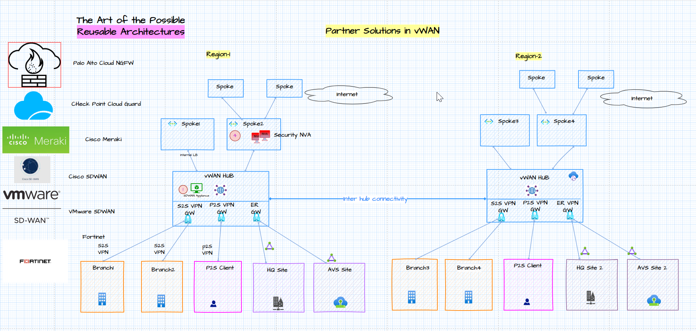
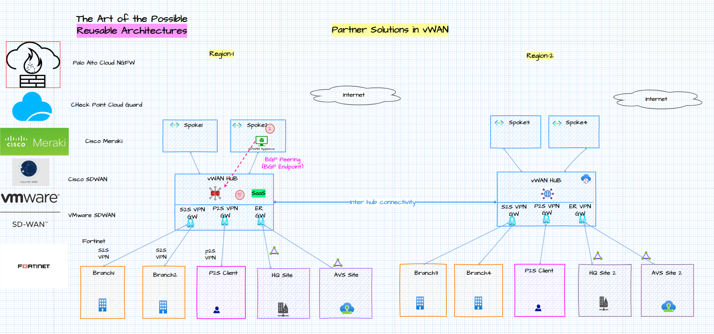

# Azure Networking: The Art of The Possible and the *why*

The purpose of this repo is to deliver **layered, reusable and github friendly** network architecture diagrams for Cloud Solutions Architects to run effective Azure design and skilling sessions. The content is based on **real customer and partner design sessions** with collaboration from cross-functional architects. The repository will include tips and tools for effective story telling that explain the **why behind the design options based on requirements** and the art of the possible.  The design areas include - Azure Networking, Hybrid connectivity architectures, routing, firewalling, load balancing, multi-region, secure design, cross functional networking areas and AKS networking.   The networking complexity is broken down into **layers** with **one diagram** per design area using [draw.io](https://app.diagrams.net/) now [diagrams.net](https://www.diagrams.net/). This repo will include configuration snippets to reduce the lab prep time and the need to leave the labs running for demos.

# Scope: Reusable and Layered Network Diagrams

### Target Audience:  
Cloud Solution Architects, Network Architects, Cloud Infrastructure Architects, Solution Engineers

### Scope
- Build Reusable and github friendly network architecture diagram templates
- Layered diagrams to run effective Azure Design and skilling sessions 
- Real world use cases dervied from working with Microsoft customers
- Level 100 to level 400 scenarios in one diagram
- Understand the why behind the design decision
- Minimize lab time
- Growth mindset

# [My YouTube Channel](https://www.youtube.com/@nehalineogi)

# Playlists

### [Drawio Basics and layered network diagrams playlist](https://youtu.be/-5tKnS03I5Y)
### [AI Foundry Networking](https://www.youtube.com/playlist?list=PLb4hYfatvJJjLOs8TjjXgw-2BP2y0sWFc)
### [Azure Networking Series](https://www.youtube.com/watch?v=-5tKnS03I5Y&list=PLb4hYfatvJJgFVWN7RDITbv8y3Qp2RVgE)
### [AKS Networking Series](https://www.youtube.com/playlist?list=PLb4hYfatvJJgFVWN7RDITbv8y3Qp2RVgE)

### [ML Studio Networking](https://www.youtube.com/playlist?list=PLb4hYfatvJJjn9x8hiy6qzzO1snMb613G)
### [ISV Series: Security and SDWAN Partners in vWAN](https://www.youtube.com/playlist?list=PLb4hYfatvJJhNyUpS9LX4RtllDYXhtZ75)
### [Azure VMware Solution Series](https://www.youtube.com/playlist?list=PLb4hYfatvJJiGinTehdteuv1EXm6dbLKf)
### [Cross Functional Series](https://www.youtube.com/playlist?list=PLb4hYfatvJJj3QKHkwrdnQZCcJpYXso3X)

### [Public facing webinars](https://studio.youtube.com/playlist/PLb4hYfatvJJiRWkn5JPg1KtWFV5lfHl-o/edit)

# Download all drawio diagrams [here](/diagrams)

# Future Topics and Series that i'm thinking about...

1. APIM Networking
2. Azure Network Security (AzFW, DDoS)
3. ExpressRoute Designs
4. AVD (Azure Virtual Desktop)
6. SAP on Azure
7. SQL MI Networking
8. Azure IoT Networking
9. AVNM (Azure Virtual Network Manager)

# Design Areas (Core Networking)
## Azure Hub-Spoke Design

Download [draw.io diagram](diagrams/hub-spoke.drawio). More information on how to open .drawio files [here](#installation).

In this session we walk through the Hub-spoke architecure design. This design includes the following layers.

- Hybrid Connectivity Architecture with hub-spoke design
- Site-to-site, Point-to-Site and ExR connected Branches
- Default traffic Flows
- Variation of the default design based on requirements
- Use case for AzFw  
- Use case for ARS (Azure Route server)
- Use case for NVA (Pros and Cons)
- VPN Gateway Active Active design challange
- Multi-region design
- Configuration snippets
- Concepts
- Limitations

## vWAN (Azure Virtual WAN)

Download [draw.io diagram](diagrams/vwan.drawio). More information on how to open .drawio files [here](#installation).

In this session we walk through the vWAN architectures. This design includes the following layers:
 - Hybrid Connectivity Architecture
 - Single region default flows with Azure vWAN
 - Multi region default flows with Azure vWAN
 - Secured vWAN
 - BGP Endpoint feature use case
 - Use case for routing intent
 - Use case for NVA in indirect spokes
 - Use case for Custom Routing
 - Multiregion with ExR Boe-tie design

## Load balancing in Azure

Download [draw.io diagram](diagrams/load-balancing.drawio). More information on how to open .drawio files [here](#installation).

In this session we walk through the load balancing architectures. This design includes the following layers
 - Azure load balancer (layer 4)
 - Azure application Gateway (layer 7)
 - Cross Region Load Balancer
 - Azure Traffic Manager (Global)
 - Azure Front door (AFD)
 - Azure Gateway Load Balancer
 - Multi-region design
 - Use case for Private endpoint with AFD

## DNS in Azure

Download [draw.io diagram](diagrams/dns-in-azure.drawio). More information on how to open .drawio files [here](#installation).

In this session we walk through the DNS options in Azure.his design includes the following layers

- DNS Options in Azure
- Default DNS configuration 
- Custom DNS
- Hybrid DNS
- Private DNS Zones
- Azure Private DNS Resolver

## NVA High availability

Download [draw.io diagram](diagrams/NVA-ha.drawio). More information on how to open .drawio files [here](#installation).

This design includes the following layers:
- NVA LB Sandwich design
- Challenge: Preserving flow symettry
- North South flows
- East West Flows
- Packet Captures
- Use case Floating IP
- Use case for HA Ports
- Configuration Snippets

## Private Endpoints

Download [draw.io diagram](diagrams/private-EP.drawio). More information on how to open .drawio files [here](#installation).

This design includes the following layers:
- Service Endpoint
- Private Endpoint
- Private Link Service
- VNET Integration vs Private Endpoint
- Use case with Azure Front Door (AFD) with Private Endpoint
- Use case with AKS

# Design Areas (Cross Functional)
## Azure AI Studio Network design
Download [draw.io diagram](diagrams/azure-ai.drawio). More information on how to open .drawio files [here](#installation).

This design includes the following layers (Note: AI Studio TAB)
- AI Studio Prompt flow with Managed VNET and Private endpoints
- Short Demo with AI Studio Playground
- Azure AI Studio Architecture Components (PaaS and IaaS)
- Key Concepts (Private Endpoints, Webapp, Embedding and Vector Database, Managed EP, AI Models and Prompt flow)
- Traffic flows with managed VNET with Private Endpoints
- [FAQ and Feedback Links](Agenda/ai-studio-session.md)

## ML Studio Networking
Download [draw.io diagram](diagrams/azure-ai.drawio). More information on how to open .drawio files [here](#installation).

This design includes the following layers (Note: ML Studio TAB)

- Public Networking
- BYO VNET
- Managed VNET (Private with Internet Outbound)
- Managed VNET (Private with Approved Outbound)
- All traffic flows (inbound/outbound)

Upcoming topics in this series:
- Powerapp and power platform integration
- BYO Data

## Azure VMware Solutions Network design
Download [draw.io diagram](diagrams/AVS.drawio). More information on how to open .drawio files [here](#installation).

- On-Prem Connectivity Using Global Reach
- VPN ER Transit using ARS
- Network Virtual Appliance (NVA) in Azure VNET (with ARS)
- Transit VNET design with NVA in Azure NVET (with ARS)
- Deploy third party Virtual Apppliance using NSX-T segments within AVS
- Secured vWAN HUB Design with Routing Intent

## Azure VMware Solutions HCX MON

## 📺 Video Chapters – Azure VMware Solution: HCX MON Part-1
Download [draw.io diagram](diagrams/AVS.drawio)
- [00:00:00 – Welcome and Introductions](https://youtu.be/ryeu8IFg2pI?t=0)
- [00:02:31 – HCX MON Lab – The Vision and Big Picture](https://youtu.be/ryeu8IFg2pI?t=151)
- [00:11:54 – Deploy Simulated On-Prem (AVS SDDC) from Scratch](https://youtu.be/ryeu8IFg2pI?t=714)

**AVS Side:**
- [00:17:00 – Deploy AVS Side](https://youtu.be/ryeu8IFg2pI?t=1020)
- [00:20:41 – Deploy ER Gateway](https://youtu.be/ryeu8IFg2pI?t=1241)
- [00:23:44 – The Jump Host](https://youtu.be/ryeu8IFg2pI?t=1424)
- [00:24:28 – Create a Connection](https://youtu.be/ryeu8IFg2pI?t=1468)
- [00:27:48 – AVS: Inbound/Outbound Flows](https://youtu.be/ryeu8IFg2pI?t=1668)
- [00:29:15 – NSX Concepts and IP Address Planning](https://youtu.be/ryeu8IFg2pI?t=1755)
- [00:38:58 – Launch vCenter and NSX Manager](https://youtu.be/ryeu8IFg2pI?t=2338)
- [00:40:57 – vCenter Overview](https://youtu.be/ryeu8IFg2pI?t=2457)
- [00:50:28 – NSX Manager Overview](https://youtu.be/ryeu8IFg2pI?t=3028)
- [01:02:54 – Segments, DHCP, DNS](https://youtu.be/ryeu8IFg2pI?t=3774)
- [01:15:44 – Deploy VM](https://youtu.be/ryeu8IFg2pI?t=4544)
- [01:20:00 – Run Validations and Troubleshooting](https://youtu.be/ryeu8IFg2pI?t=4800)
- [01:30:08 – Enable HCX](https://youtu.be/ryeu8IFg2pI?t=5408)
- [01:31:15 – Configure Simulated On-Prem Side](https://youtu.be/ryeu8IFg2pI?t=5475)
- [01:52:15 – AVS Interconnect](https://youtu.be/ryeu8IFg2pI?t=6735)

**HCX MON Demo:**
- [01:59:34 – Enable VMware HCX (Simulated On-Prem)](https://youtu.be/ryeu8IFg2pI?t=7174)
- [02:03:25 – Create HCX Site Pairs and Interconnect](https://youtu.be/ryeu8IFg2pI?t=7405)
- [02:24:26 – L2 Extension – Architecture and Flows](https://youtu.be/ryeu8IFg2pI?t=8666)
- [02:31:09 – L2 Extension – Troubleshooting](https://youtu.be/ryeu8IFg2pI?t=9069)
- [02:52:01 – Enable MON](https://youtu.be/ryeu8IFg2pI?t=10321)
- [02:58:10 – Asymmetric Routing](https://youtu.be/ryeu8IFg2pI?t=10690)
- [03:01:25 – HCX Policy Routes](https://youtu.be/ryeu8IFg2pI?t=10885)
- [03:11:26 – Test VM Migration](https://youtu.be/ryeu8IFg2pI?t=11486)
- [03:20:10 – Unextend Network](https://youtu.be/ryeu8IFg2pI?t=12010)
- [03:22:47 – DNS and DHCP Troubleshooting and Orchestration](https://youtu.be/ryeu8IFg2pI?t=12167)
- [03:30:17 – Closing Thoughts and Thank You!](https://youtu.be/ryeu8IFg2pI?t=12617)

## AKS Networking
Download [draw.io diagram](diagrams/aks.drawio). More information on how to open .drawio files [here](#installation).

This design includes the following layers

- Azure CNI
- Azure Kubenet
- Azure CNI Overlay
- Dual Stack (IPv6 and IPv4) in AKS
- Nginx ingress
- App GW Ingress
- AzFW Firewall egress
- NAT Gateway egress
- Furture Topics in this series...

    BYO CNI (Cilium/Isovalent)

    AGC (Application Gateway for Containers)

    AKS Private Cluster

    Multi-region Designs with Azure Front Door

    App-Dev Integration
            - Azure Data platform integration (Example: SQL MI integration, SQL DB, Cosmos DB, OSS DB (mysql, postgreSQL), blob storage)
            - Multi-region with Relational DB(SQLMI, SQL DB, OSS DB) (Single Master) (Shopping cart)
            - Multi-region with Non-relational or NoSQL (Cosmos DB, MongoDB) (Multi Master) (catalog db)

# Azure Container Apps and App Service Networking
Download [draw.io diagram](diagrams/aks.drawio). More information on how to open .drawio files [here](#installation).
## 📺 Video Chapters – Art of The Possible Series

- [00:00:00 – Welcome to the Art of The Possible Series](https://youtu.be/2d9wqFisv6A?t=0)
- [00:01:39 – Hybrid Cloud Architecture and draw.io](https://youtu.be/2d9wqFisv6A?t=99)
- [00:03:39 – External Mode: Architecture and Portal Experience](https://youtu.be/2d9wqFisv6A?t=219)
- [00:15:44 – External Mode: With Private Endpoint (Preview)](https://youtu.be/2d9wqFisv6A?t=944)
- [00:21:08 – External Mode: With Front Door and Private Endpoint (Preview)](https://youtu.be/2d9wqFisv6A?t=1268)
- [00:27:41 – External Mode: Azure Front Door Custom Domain](https://youtu.be/2d9wqFisv6A?t=1661)
- [00:37:50 – Internal Mode: Architecture](https://youtu.be/2d9wqFisv6A?t=2270)
- [00:58:02 – Internal Mode: With Application Gateway](https://youtu.be/2d9wqFisv6A?t=3482)
- [01:12:12 – Internal Mode: With Application Gateway and Front Door](https://youtu.be/2d9wqFisv6A?t=4332)
- [01:23:45 – Outbound from Container App (NAT GW and AzFW)](https://youtu.be/2d9wqFisv6A?t=5025)
- [01:29:03 – Multi-region design](https://youtu.be/2d9wqFisv6A?t=5343)
- [01:31:29 – Troubleshooting Tips…](https://youtu.be/2d9wqFisv6A?t=5489)
- [01:34:15 – Closing Thoughts and Thank You…](https://youtu.be/2d9wqFisv6A?t=5655)

## ISV Series: Security and SDWAN Partners in vWAN
Download [draw.io diagram](diagrams/vwan.drawio). More information on how to open .drawio files [here](#installation).

Vendor dedicated videos available:

Full Playlist here: https://www.youtube.com/playlist?list=PLb4hYfatvJJhNyUpS9LX4RtllDYXhtZ75

- Check Point Software CloudGuardwith John Guo
- Palo Alto Networks Cloud NGFW Architecture and demo with Anton Budilovskiy and Salman Syed
- Fortinet NGFW and SDWAN with Martin Twombly
- Cisco SDWAN with Juan Ignacio Sterbenc Simarbir Singh
- Cisco Meraki SDWAN with Juan
- VMware SDWAN by Broadcom with Vivek Achar

## Data Series 
### Azure Data Factory Networking
Download [📐 draw.io diagram](diagrams/data-architectures.drawio).  
More information on how to open `.drawio` files can be found [here](#installation).  

---

## 🎥 Azure ADF and Azure Fabric Networking (Data movement and orchestration)

[Watch on YouTube](https://youtu.be/KLPRST4nNNU)

- [00:00:00 – Welcome and introductions](https://youtu.be/KLPRST4nNNU?t=0)  
- [00:01:59 – ADF Concepts - Network Perspective](https://youtu.be/KLPRST4nNNU?t=119)  
- [00:07:41 – The Big Picture](https://youtu.be/KLPRST4nNNU?t=461)  
- [00:10:11 – Scenario: AutoResolve Integration Runtime (Public Networking)](https://youtu.be/KLPRST4nNNU?t=611)  
- [00:31:12 – Private Endpoint and DNS Deep dive](https://youtu.be/KLPRST4nNNU?t=18672)  
- [01:02:43 – Scenario: Self Hosted IR (On-premises) (Private Networking)](https://youtu.be/KLPRST4nNNU?t=3763)  
- [01:14:09 – P2S VPN and Private Endpoints](https://youtu.be/KLPRST4nNNU?t=4449)  
- [01:35:05 – Validations and troubleshooting](https://youtu.be/KLPRST4nNNU?t=5705)  
- [01:42:28 – Scenario: Self Hosted IR (Azure VM)](https://youtu.be/KLPRST4nNNU?t=6148)  
- [01:51:35 – Scenario: Manage VNET IR](https://youtu.be/KLPRST4nNNU?t=6695)  
- [02:12:27 – Fabric Data Factory Networking](https://youtu.be/KLPRST4nNNU?t=7947)  
- [02:33:22 – Run Pipeline](https://youtu.be/KLPRST4nNNU?t=9202)  
- [02:43:59 – Closing thoughts and thank you!](https://youtu.be/KLPRST4nNNU?t=9839)  
  
## Future
- Azure Databricks (Coming up next!)
- Azure Synapse
- Azure Datalake or blob storage
- SQL MI (source and destination)
- Third Party Cloud (GCP)
- Hybrid SQL Server On-premise
- Cosmos DB, SQL DB (source and destination)
- OSS Databases (postgreSQL, mysql, mariadb)

## Future: Azure API Management (APIM)
- APIM Big Picture view
- Default mode
- External network mode
- Internal network mode
- Internal network mode with Azure Application Gateway
- Internal network mode with AKS Backend API
- APIM with Azure firewall/NVA
- APIM Identity - AAD and B2C Integration
- APIM Multi-region Architecture
- Self hosted gateway
- LetsEncrypt Certificates and APIM Custom Domain
- Azure Private DNS Zones integration
- Network Troubleshooting

# Tooling - Draw.io (now diagrams.net)
## Features

Draw.io is [feature rich](https://www.diagrams.net/blog). I've listed my top 10 favorite features that are useful for drawing network architecture diagrams

1. [Add Shapes](https://www.diagrams.net/blog/azure-diagrams): View -> Shapes -> Add Shapes -> Azure. 
2. [Add Layers](https://www.diagrams.net/blog/interactive-diagram-layers): View -> Layers. Create layers and show hide layers.
3. [Add Scratchpad](https://www.diagrams.net/blog/azure-diagrams): View -> Scratchpad
4. View Outline: View -> Outline
5. Flow animation: Select Flow -> Flow animation
6. [Sketch Style](https://www.diagrams.net/blog/rough-style) (hand drawn style)
7. [Whiteboard](https://www.diagrams.net/blog/change-editor-mode):  Extras-> Theme-> Sketch
8. [Curved lines](https://drawio-app.com/curved-connectors-in-draw-io-diagrams/) for flows
9. [vscode integration](https://marketplace.visualstudio.com/items?itemName=hediet.vscode-drawio)
10. [Group shapes](https://drawio-app.com/more-draw-io-shortcuts-to-streamline-your-diagramming/) using CTRL-G

## Installation

There are three options to open the draw.io diagrams.

1. Use the desktop app
    Download the desktop app from the microsoft store. 
    

    Dowload drawio file from github and open in the desktop app. File -> Raw -> Save link as.
    
    
2. Use the web browser to open the file online using the link [here](https://app.diagrams.net/)

3. Integrate with vscode using the 

## Acknowledgement

Special thank you to my colleagues

- [David O'Keefe](https://www.linkedin.com/in/david-o-keefe/)
- [Shaun Croucher](https://github.com/shcrouch)
- [Xavier Elizondo](https://github.com/xelizondo)
- [Heather Tze](https://github.com/hsze)
- [Mays Algebary](https://github.com/malgebary)
- [Daniel Mauser](https://github.com/dmauser)
- Shruthi Nair
- [Jose Moreno](https://github.com/erjosito)
- [Sowmyan Soman Chullikkattil](https://github.com/sowsan)
- [Mike Richter](https://github.com/michaelsrichter)
- [Mike Shelton](https://www.linkedin.com/in/mshelt)
- [Tommy Falgout](https://github.com/lastcoolnameleft)
- [Amanda Wong](https://github.com/wongamanda)
- Israel Ekpo
- [Jason Medina](https://github.com/jasonamedina)

