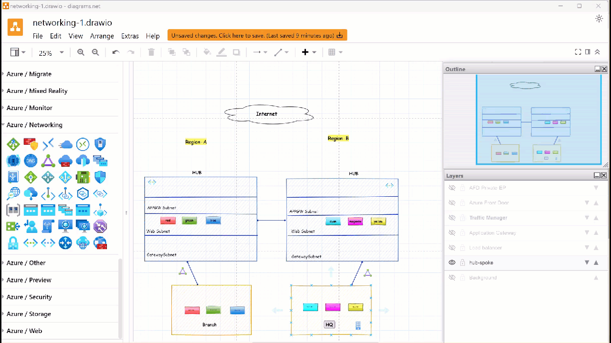
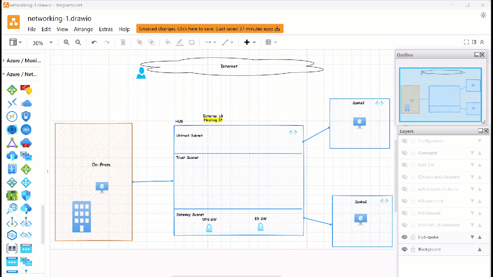
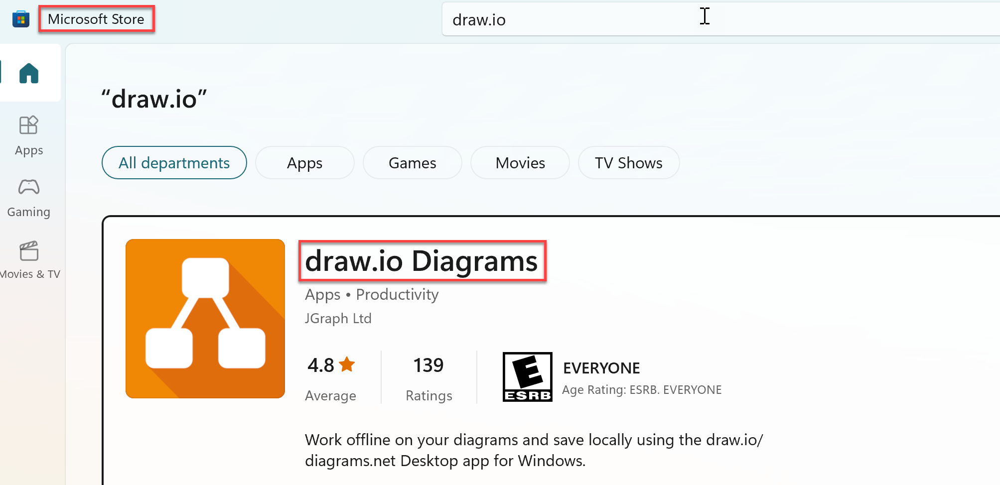
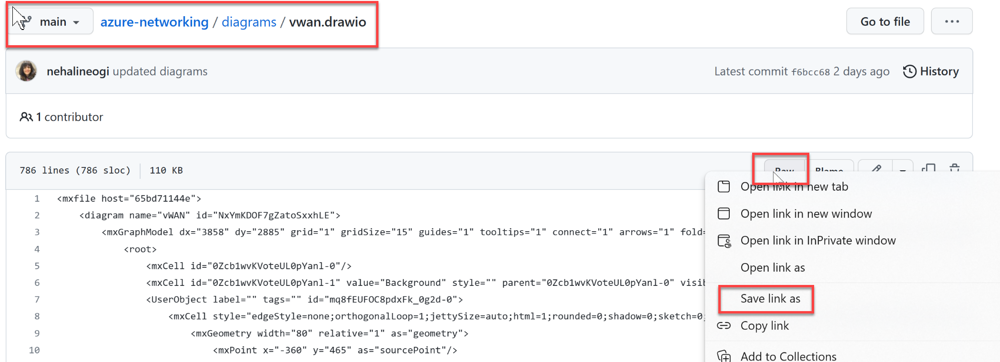
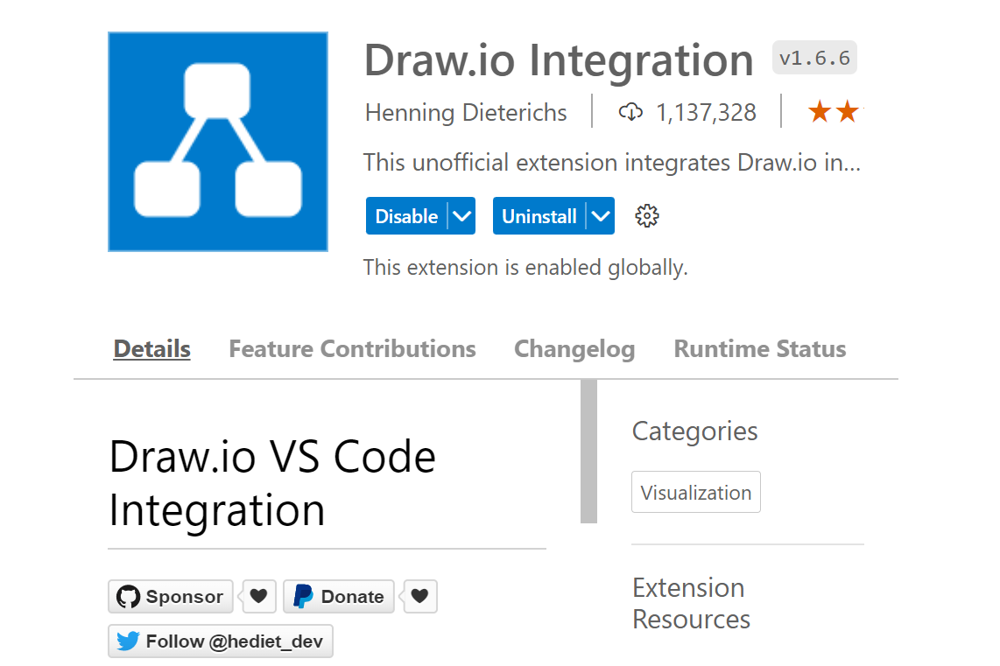

# The Art of The Possible and the *Why*

> Layered, reusable, and GitHub-friendly network architecture diagrams for Cloud Solution Architects — built from real customer and partner design sessions.

  

  <a href="https://www.youtube.com/@nehalineogi"><strong>📺 YouTube Channel</strong></a>
  &nbsp;&nbsp;|&nbsp;&nbsp;
  <a href="https://diagrams.penguintrails.com/gallery.html"><strong>🌐 Interactive Diagram Gallery</strong></a>
  &nbsp;&nbsp;|&nbsp;&nbsp;
  <a href="https://github.com/nehalineogi/azure-networking/tree/main/diagrams"><strong>⬇️ Download Diagrams</strong></a>

---

The purpose of this repo is to deliver **layered, reusable, and GitHub-friendly** network architecture diagrams for Cloud Solution Architects to run effective Azure design and skilling sessions. The content is based on **real customer and partner design sessions** with collaboration from cross-functional architects. The design areas include Azure Networking, Hybrid connectivity, routing, firewalling, load balancing, multi-region, secure design, and AKS networking. Networking complexity is broken down into **layers** with **one diagram per design area** using [diagrams.net](https://www.diagrams.net/).

---

# Scope: Reusable and Layered Network Diagrams

### Target Audience
Cloud Solution Architects · Network Architects · Cloud Infrastructure Architects · Solution Engineers

### Goals
- Build reusable, GitHub-friendly network architecture diagram templates
- Layered diagrams to run effective Azure design and skilling sessions
- Real-world use cases derived from working with Microsoft customers
- Level 100 → Level 400 scenarios in one diagram
- Understand the *why* behind each design decision
- Minimize lab time with configuration snippets

---

## ⬇️ Download Diagrams

**[Browse the Interactive Gallery →](https://diagrams.penguintrails.com)**

---

# Core Networking Diagrams

<table>
<tr>
<td align="center" width="33%">

### 🔗 Hub & Spoke

[⬇️ Download](diagrams/hub-spoke.drawio)

</td>
<td align="center" width="33%">

### 🌐 Virtual WAN

[⬇️ Download](diagrams/vwan.drawio)

</td>
<td align="center" width="33%">

### ⚖️ Load Balancing

[⬇️ Download](diagrams/load-balancing.drawio)

</td>
</tr>
<tr>
<td align="center">

### 🌍 DNS in Azure

[⬇️ Download](diagrams/dns-in-azure.drawio)

</td>
<td align="center">

### 🛡️ NVA High Availability

[⬇️ Download](diagrams/NVA-ha.drawio)

</td>
<td align="center">

### 🔒 Private Endpoints

[⬇️ Download](diagrams/private-EP.drawio)

</td>
</tr>
</table>

---

# Cross-Functional Diagrams

<table>
<tr>
<td align="center" width="50%">

### 🤖 AI Studio (AI Foundry) Networking

[⬇️ Download](diagrams/azure-ai.drawio)

</td>
<td align="center" width="50%">

### 🧠 ML Studio Networking

[⬇️ Download](diagrams/azure-ai.drawio)

</td>
</tr>
<tr>
<td align="center">

### ☸️ AKS Networking

[⬇️ Download](diagrams/aks.drawio)

</td>
<td align="center">

### 🖥️ Azure VMware Solution (AVS)

[⬇️ Download](diagrams/AVS.drawio)

</td>
</tr>
<tr>
<td align="center">

### 📦 Azure Container Apps

<video src="design-gifs/aca.mp4" controls width="100%"></video>

[⬇️ Download](diagrams/aks.drawio)

</td>
<td align="center">

### 🏭 Azure Data Factory

<video src="design-gifs/adf.mp4" controls width="100%"></video>

[⬇️ Download](diagrams/data-architectures.drawio)

</td>
</tr>
</table>

---

# YouTube Playlists

| Series | Playlist |
|--------|----------|
| 🎨 draw.io Basics & Layered Diagrams | [Watch](https://youtu.be/-5tKnS03I5Y) |
| 🌐 Azure Networking Core Series | [Watch](https://www.youtube.com/watch?v=-5tKnS03I5Y&list=PLb4hYfatvJJgFVWN7RDITbv8y3Qp2RVgE) |
| ☸️ AKS Networking Series | [Watch](https://www.youtube.com/playlist?list=PLb4hYfatvJJiIzPftv85zYFq7PXnUY2Zg) |
| 🤖 AI Foundry Networking | [Watch](https://www.youtube.com/playlist?list=PLb4hYfatvJJjLOs8TjjXgw-2BP2y0sWFc) |
| 🧠 ML Studio Networking | [Watch](https://www.youtube.com/playlist?list=PLb4hYfatvJJjn9x8hiy6qzzO1snMb613G) |
| 🖥️ Azure VMware Solution Series | [Watch](https://www.youtube.com/playlist?list=PLb4hYfatvJJiGinTehdteuv1EXm6dbLKf) |
| 🔌 ISV Series: Security & SD-WAN in vWAN | [Watch](https://www.youtube.com/playlist?list=PLb4hYfatvJJhNyUpS9LX4RtllDYXhtZ75) |
| 🔗 Cross Functional Series | [Watch](https://www.youtube.com/playlist?list=PLb4hYfatvJJj3QKHkwrdnQZCcJpYXso3X) |

---

# Tooling — draw.io (now diagrams.net)
## Features

draw.io is [feature-rich](https://www.diagrams.net/blog). Top 10 features for network architecture diagrams:

1. **[Add Azure Shapes](https://www.diagrams.net/blog/azure-diagrams)** — View → Shapes → Add Shapes → Azure
2. **[Layers](https://www.diagrams.net/blog/interactive-diagram-layers)** — View → Layers → show/hide per scenario
3. **[Scratchpad](https://www.diagrams.net/blog/azure-diagrams)** — View → Scratchpad
4. **Outline** — View → Outline (great for large diagrams)
5. **Flow Animation** — Select flow → Flow animation
6. **[Sketch Style](https://www.diagrams.net/blog/rough-style)** — hand-drawn look for workshops
7. **[Whiteboard Mode](https://www.diagrams.net/blog/change-editor-mode)** — Extras → Theme → Sketch
8. **[Curved Connectors](https://drawio-app.com/curved-connectors-in-draw-io-diagrams/)** — for cleaner flow lines
9. **[VS Code Integration](https://marketplace.visualstudio.com/items?itemName=hediet.vscode-drawio)** — edit diagrams in VS Code
10. **[Group Shapes](https://drawio-app.com/more-draw-io-shortcuts-to-streamline-your-diagramming/)** — Ctrl+G

## Installation

Three options to open draw.io diagrams:

**Option 1 — Desktop App**

Download from the Microsoft Store, then open any `.drawio` file locally.

Download a diagram from GitHub: File → Raw → Save link as.

**Option 2 — Browser**

Open online at [app.diagrams.net](https://app.diagrams.net/)

**Option 3 — VS Code Extension**

---

## Acknowledgement

Special thank you to my colleagues:

- [David O'Keefe](https://www.linkedin.com/in/david-o-keefe/)
- [Shaun Croucher](https://github.com/shcrouch)
- [Xavier Elizondo](https://github.com/xelizondo)
- [Heather Tze](https://github.com/hsze)
- [Mays Algebary](https://github.com/malgebary)
- [Daniel Mauser](https://github.com/dmauser)
- Shruthi Nair
- [Jose Moreno](https://github.com/erjosito)
- [Sowmyan Soman Chullikkattil](https://github.com/sowsan)
- [Mike Richter](https://github.com/michaelsrichter)
- [Mike Shelton](https://www.linkedin.com/in/mshelt)
- [Tommy Falgout](https://github.com/lastcoolnameleft)
- [Amanda Wong](https://github.com/wongamanda)
- Israel Ekpo
- [Jason Medina](https://github.com/jasonamedina)

